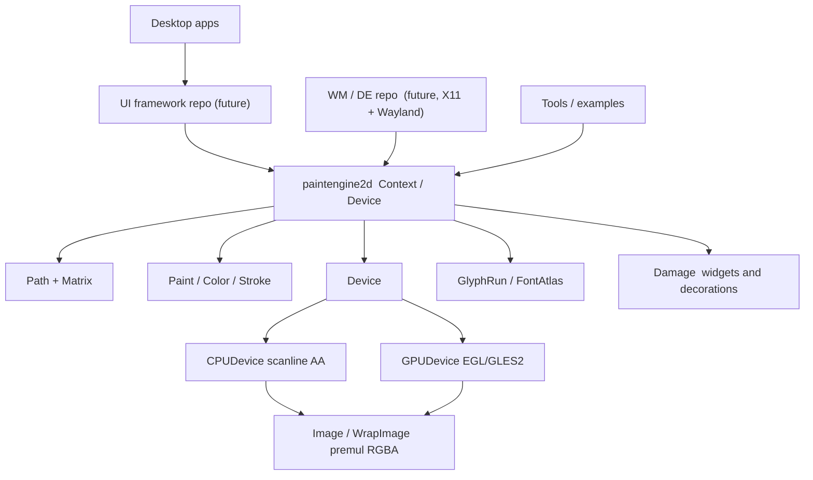

# paintengine2d

**Shared pure-Go paint engine** — a library, not an app. Import
`github.com/codemodify/paintengine2d`. Two future repositories (not this
one) will consume it:

1. **UI framework** — widgets, layout, windows-as-app-UI; paints into a
   buffer / swapchain.
2. **Desktop environment / window manager** — X11 and Wayland; paints
   window contents, **borders**, titlebars, decorations, panels into
   surfaces.

This repo is pixels + paths + clips + images + text hooks + `Device`.
No X11, Wayland, or Win32. No widgets.

Best-in-class for *Go UI painting* inside a UI subset (not Skia feature
parity). The public API is pure Go. CPU is CGO-free; GPU is optional
Linux EGL/GLES (`UITK_PAINT=gpu|auto`).

```go
img := paintengine2d.NewImage(640, 360)
ctx := paintengine2d.NewContext(img)
ctx.Clear(paintengine2d.RGB(0.10, 0.11, 0.14))
ctx.DrawCircle(paintengine2d.Pt(180, 180), 90, paintengine2d.Fill(paintengine2d.RGB(0.2, 0.5, 0.95)))
_ = img.WritePNGFile("out.png")
```

```bash
go get github.com/codemodify/paintengine2d@v0.9.0
```

**UI-foundation ready.** This module is the paint layer a separate UI
kit and a separate WM/DE can start on. See the checklist and API
stability notes below.

**Not** a widget toolkit. **Not** a window manager. **Not** Gio.
**Not** a Skia / Cairo binding. The UI framework and WM sit *on top*.

| | |
| --- | --- |
| Language | Go 1.22+ |
| CGO | none for CPU; optional Linux EGL/GLES for [GPUDevice] |
| License | MIT |
| Pixel format | premultiplied 8-bit sRGB RGBA (packed or padded `Stride`) |

## Motivation

Go's standard library can encode images, but it does not ship a paint engine.
This is the default-choice **Go paint core** for both in-app UI and
compositor chrome: rects, curves, clips, images, dirty-rects, and a text
*hook* (glyph atlas blit). Attach a caller buffer with [WrapImage] (packed
or padded stride). Widget trees, windowing, and IME are out of this
repository. A GPU `Device` implements the same Paint sites (`UITK_PAINT=gpu|auto`).

Inspiration (algorithms and API shape only — no vendored code):

- **AGG / Blend2D** — CPU scanline anti-aliasing
- **JUCE Graphics** — high-level facade + `LowLevel` backend
- **Skia `SkCanvas`** — canvas completeness (save, clip, path, image)
- **Evas** — dirty-rect / damage helper for partial UI redraw
- **Gio** — idiomatic Go packaging

## Quick start

```bash
git clone https://github.com/codemodify/paintengine2d.git
cd paintengine2d
go test ./...
go run ./examples/hello -o hello.png
```

`hello.png` should show a rounded rectangle, a cubic blob, and a thick
anti-aliased ring — curved edges blend into the background instead of stair-stepping.

```bash
go run ./examples/gallery -o gallery.png
go run ./examples/paths  -o paths.png
```

## Feature matrix

| Feature | v0.9.0 | Notes |
| --- | :---: | --- |
| Path + rect / round-rect / ellipse / arc / curves | **done** | `DrawArc` / `AddArc` |
| Affine transforms + save/restore | **done** | |
| Solid fill, src-over | **done** | only blend mode |
| Linear gradients | **done** | clamp / repeat / mirror |
| Radial gradients | extra | present; not required for UI bar |
| Stroke caps / joins / miter | **done** | width ≤ 0 is a no-op |
| Dashes | extra | present; not required for UI bar |
| Clip rect + clip path | **done** | intersect; `ClipPathRule` for even-odd |
| Image blit nearest + bilinear | **done** | `Paint.Color` RGB-tints premul samples |
| Wrap existing pixmap (`WrapImage`) | **done** | packed or padded stride |
| Dirty-rect `Damage` | **done** | widgets **and** decoration redraws |
| Clip queries / `QuickReject` | **done** | framework skip-paint |
| Text hooks (`FontAtlas`, `GlyphRun`, `Shaper`) | **done** | [NullShaper] + 5×7 atlas; `GlyphRun.Bounds`; no OpenType |
| Scanline AA | **done** | |
| `Device` + `CPUDevice` | **done** | |
| `GPUDevice` (Linux EGL/GLES2) | **done** | stencil-and-cover; flatten/tess cache; atlas epoch; rect batches |
| Retained `Scene` / `Recorder` / `DrawScene` | **done** | group attach + GPU opaque AA rect batch |
| SIMD / HDR / PDF | deferred | |
| X11 / Wayland / Win32 windowing | **other repos** | |
| Widgets, IME, a11y, WM policy | **other repos** | |

**Text:** [Context.DrawGlyphs] blits a font atlas. [Paint.Color] multiplies
premul samples so a white sheet can be themed. [Context.DrawLabel] uses
[NullShaper] for ASCII bitmap labels. A future shaper implements [Shaper]
only — no Context/Device break. IME, bidi, line-break, and a11y are
framework concerns.

## Layering (this module vs future repos)

```
Engine (this repo)     github.com/codemodify/paintengine2d
        │
        ├──► UI framework repo (future)
        │         └──► desktop apps (widgets, layout, windows-as-app-UI)
        │
        └──► WM / DE repo (future)
                  └──► X11 + Wayland surfaces
                       (window contents, borders, titlebars, panels)
```

**This repo does not** create windows, talk to X11/Wayland/Win32, or
define widgets. Those peers import this module and pass it pixels.

| Consumer | Paints into | Uses from this engine |
| --- | --- | --- |
| UI framework | app buffer / swapchain (`NewImage` or `WrapImage`) | `Context` widget `Paint`, `Damage` for dirty widgets |
| WM / DE | surface shm (`WrapImage`, stride may be padded) | same `Context` for borders, titlebars, panels; `Damage` for decoration strips |
| Tools / tests | owned `NewImage` | examples, goldens |

Typical **app-UI** paint (framework-owned, not in this repo):

```go
img := paintengine2d.WrapImage(swapchainBuf, w, h, stride)
ctx := paintengine2d.NewContext(img)
ctx.SetDamage(&dirty)
for _, w := range widgets {
    if !dirty.Overlaps(w.DeviceBounds) || ctx.QuickReject(w.LocalBounds) {
        continue
    }
    ctx.Save()
    ctx.Translate(w.X, w.Y)
    ctx.ClipRect(w.LocalBounds)
    w.Paint(ctx)
    ctx.Restore()
}
```

Typical **decoration** paint (WM-owned, not in this repo):

```go
surf := paintengine2d.WrapImage(wlShm, sw, sh, shmStride)
ctx := paintengine2d.NewContext(surf)
if dirty.Overlaps(titlebar) {
    ctx.Save()
    ctx.ClipRect(titlebar)
    ctx.DrawRect(titlebar, fill)
    ctx.DrawLabel(title, atlas, origin, paint)
    ctx.Restore()
}
```

Stable on purpose: [Context], [Device], [Image] / [WrapImage], [Damage],
[GlyphRun] / [Shaper], pixel format (premul RGBA8888). Do not expect
SaveLayer, PDF, windowing, or a widget kit from this module.

## Architecture



- **`Context`** is the public canvas. It owns the transform / clip / paint stack.
- **`Device`** is the low-level backend (JUCE `LowLevelGraphicsContext` analogue).
  Geometry arrives in user space plus an affine `Matrix`; clip is already in
  device pixels. A GPU implementation can consume that without API breakage.
- **`CPUDevice`** flattens curves in device space, expands strokes in user
  space (width follows the transform), then rasterizes.
- **`GPUDevice`** (Linux + CGO) flattens the same paths, expands strokes with
  the same pool, then fills with stencil-and-cover. Flattened contours and
  triangle fans are cached so a warm Fill/Stroke does not CPU-flatten again.
  Linear/radial ramps are 1D textures; images and glyph atlases are textured
  quads keyed on [Image.Epoch]. Clip path masks from `Context` are uploaded
  as coverage textures. `DrawScene` batches opaque axis-aligned rects.
  `UITK_PAINT=cpu` (or `CGO_ENABLED=0`) keeps the CPU engine. `gpu` requires
  EGL; `auto` (unset) tries GPU and falls back.

### Scanline AA (v0)

Hypothesis, verified in tests: an AGG-inspired **scanline** approach is the
right v0 tradeoff — maintainable, visibly anti-aliased, no CGO.

1. Flatten quads/cubics (adaptive de Casteljau, ~0.2 px tolerance).
2. Build directed, non-horizontal edges.
3. For each pixel row, take **8** vertical sample lines.
4. At each sample, compute exact X intersections, walk winding
   (non-zero or even-odd), and add **analytical horizontal coverage**.
5. Quantize coverage to 0–255 and src-over blend into the premul pixmap.

Axis-aligned solid rectangles use a closed-form coverage fast path (and a
zero-alloc opaque integer blit).

Curved edges show intermediate coverage; that is asserted in
`TestCircleInteriorAndAARim` and locked by golden PNGs under `testdata/golden/`.

### Pixel format

`Image.Pix` is **premultiplied** 8-bit sRGB RGBA. `NewImage` is packed
(`Stride = Width * 4`). `WrapImage` accepts a caller buffer whose row
stride may be padded (Wayland/X11 shm). A 50% red pixel is approximately
`(128, 0, 0, 128)`, not `(255, 0, 0, 128)`.
`WritePNG` / `DecodePNG` convert to and from straight alpha for the standard
library. `Image` implements `image.Image` as `color.NRGBA`.

User space: +X right, +Y down. Pixel `(0,0)` covers `[0,1] × [0,1]`.

## Context API (sketch)

```go
img := paintengine2d.WrapImage(buf, w, h, stride) // or NewImage
ctx := paintengine2d.NewContext(img)       // or NewContextDevice(yourDevice)
ctx.Save()
ctx.Translate(40, 20)
ctx.Rotate(0.3)
ctx.ClipRect(paintengine2d.XYWH(0, 0, 200, 120))
if ctx.ClipEmpty() || ctx.QuickReject(bounds) { /* skip */ }
ctx.DrawPath(path, paintengine2d.Fill(c))
ctx.DrawPath(path, paintengine2d.StrokePaint(c, 4))
ctx.StrokeRect(r)
ctx.DrawArc(center, rx, ry, start, sweep, paint)
ctx.DrawImageRect(src, srcRect, dstRect)
ctx.DrawGlyphs(run, origin, paint)
ctx.Restore()
ctx.Clear(paintengine2d.Black)             // ignores clip; resets the surface
```

`Paint.Style` may be `StyleFill`, `StyleStroke`, or `StyleStrokeAndFill`.
Convenience setters (`SetFill`, `SetStroke`, `SetColor`) feed `FillPath` /
`StrokePath` / `FillRect`.

Implement `Device` to retarget the same `Context`:

```go
type Device interface {
    Size() (w, h int)
    Clear(c Color)
    Fill(path *Path, xform Matrix, paint Paint, clip Clip)
    Stroke(path *Path, xform Matrix, paint Paint, clip Clip)
    Blit(src *Image, srcRect, dstRect Rect, xform Matrix, paint Paint, clip Clip)
}
```

## Tests, goldens, benches, fuzz

```bash
CGO_ENABLED=0 go test ./...                    # CPU only (must stay green)
CGO_ENABLED=1 go test ./...                    # + GPU tests when EGL works
UITK_PAINT=cpu go test ./...
UPDATE_GOLDENS=1 go test ./...                 # rewrite testdata/golden/*.png
go test -bench . -benchmem
go test -bench BenchmarkChrome -benchmem       # CPU vs GPU UI chrome
go test -fuzz=FuzzPathBuild -fuzztime=15s
go test -fuzz=FuzzMatrix -fuzztime=15s
go test -fuzz=FuzzRasterDraw -fuzztime=15s
go test -fuzz=FuzzClipAndImage -fuzztime=15s
go test -fuzz=FuzzWrapImage -fuzztime=15s
go test -fuzz=FuzzDamage -fuzztime=15s
go test -fuzz=FuzzTextHooks -fuzztime=15s
go test -fuzz=FuzzClipTransform -fuzztime=15s
```

Goldens compare premul RGBA with a small per-channel tolerance (37 scenes).
Quality tests also assert geometry without files (circle AA rim, winding
holes, dash gaps, nearest vs bilinear, NaN/degenerate, scaled strokes).

The suite is inspired by public AGG / Blend2D / Skia / Cairo / NanoVG /
JUCE / LibGfx / Gio *themes* (save stacks, clip intersection, dashes,
patterns, degenerate geometry). No upstream source or copyrighted goldens
are vendored — scenarios are reimplemented here.

### Bench methodology

Numbers below are from `CGO_ENABLED=0 go test -bench . -benchmem` on this
repo's CI-like host (Go 1.22, linux/amd64). Large targets are 512×512;
UI benches use widget sizes (64–256 px). `benchtime` default. This is a
**baseline for this engine**, not a claim of Blend2D/Skia parity and not
a Gio CPU bake-off on their scenes. Re-run on your machine.

| Benchmark | size | time/op | allocs/op |
| --- | --- | ---: | ---: |
| `BenchmarkFillRect` | 512² | 0.15 ms | **0** |
| `BenchmarkFillComplexPath` | 512² | 1.25 ms | **0** |
| `BenchmarkStroke` | 512² blob | 2.37 ms | **0** |
| `BenchmarkManySmallPaths` | 16×16 circles | 54 ms | 1 (was 257) |
| `BenchmarkFillCircleUI` | 64² / r=14 | 20 µs | **0** |
| `BenchmarkStrokeRoundRectUI` | 128×48 | 51 µs | **0** |
| `BenchmarkImageBlit` | 128→384 bilinear | 3.4 ms | **0** |
| `BenchmarkImageBlitNearestUI` | 32→32 1:1 | 5.9 µs | **0** |
| `BenchmarkDrawLabel` | 80×20 | 1.5 µs | 4 |
| `BenchmarkChromeCPU` | 640×420 UI chrome | 6.24 ms | 18 |
| `BenchmarkChromeGPU` | same scene, EGL/llvmpipe | **1.61 ms** | 46 |

`BenchmarkChromeGPU` is the same titlebar / buttons / track / focus-ring
sheet as a toolkit frame. On this host's Mesa llvmpipe it is ~4× faster
than CPU scanline. A real GPU should widen that gap; `UITK_PAINT=cpu`
keeps the old path.

Enable GPU:

```bash
UITK_PAINT=auto   # default: GPU if EGL init works, else CPU
UITK_PAINT=gpu    # require GPU (OpenSurface errors without EGL)
UITK_PAINT=cpu    # force CPU (also the CGO_ENABLED=0 path)
```

```go
surf, err := paintengine2d.OpenSurface(640, 360) // honors UITK_PAINT
ctx := paintengine2d.NewContextSurface(surf)
// or, targeting a toolkit EGL window:
dev, err := paintengine2d.NewGPUDeviceEGL(paintengine2d.EGLNative{
    Display: disp, Window: eglWin, Platform: paintengine2d.EGLPlatformWayland,
    Width: w, Height: h,
})
```

`TestFillRectZeroAllocs` and `TestBlitNearest1to1ZeroAllocs` guard the blit
hot paths. `TestStrokeWarmPathBoundedAllocs` / `TestFillCircleWarmZeroAllocs`
require warm stroke and circle fill to stay at 0 allocs. First-draw flatten
and clip-mask builds still allocate.

## Layout

```
paintengine2d/           public API (module github.com/codemodify/paintengine2d)
  context.go             canvas facade
  device.go              Device interface
  backend.go             Surface, UITK_PAINT, OpenSurface
  cpu.go                 CPU backend
  gpu.go / gpu_linux.go  GPUDevice (linux+cgo EGL/GLES2; stub otherwise)
  path.go geom.go …      geometry, paint, image, clip
  internal/raster/       flatten, scanline AA, stroke expand, blend
  examples/hello|gallery|paths
  text.go bitmapfont.go  glyph atlas hooks + 5×7 label atlas
  testdata/golden/       regression PNGs
  fuzz_test.go           native Go fuzz targets
```

## Positioning

**paintengine2d** is a shared paint library. A UI framework and a WM/DE
will both import it. Immediate-mode CPU rasterizer, retained dirty-rect
helpers (`Damage`, `QuickReject`). Not a widget toolkit, not a compositor,
not a Skia/Cairo binding.

Where we win today: **pure-Go API**, **own engine**, CPU without CGO,
optional Linux GPU, UI primitives plus `WrapImage` for caller surfaces.
The default paint layer under both future consumers.

Where we stop: **not the UI framework**, **not the WM**, **not Skia**.

`Damage` coalesces dirty boxes for widgets *and* decoration redraws.
Presenting those rects to X11/Wayland is the consumer's job.

### Compared with alternatives

Honest snapshot of what people usually reach for. Licenses are typical
upstream terms — check the project you actually vendor. “GPU” means a
shipping hardware backend, not a future hook.

| | Language | CGO / native deps | Engine | GPU | UI toolkit | License (typical) | Best for |
| --- | --- | --- | --- | --- | --- | --- | --- |
| **paintengine2d** | Go 1.22+ | **Optional** (EGL/GLES on Linux) | **Own** CPU scanline AA + GPU stencil-and-cover | Yes (Linux EGL) | No | MIT | Shared paint core for a UI kit **and** WM/DE; tools, tests |
| [Gio](https://gioui.org) | Go | Optional (platform windowing) | Own ops + GPU/CPU renderer | Yes | Yes (widgets, layout, input) | MIT / Unlicense | Full native Go GUIs; not a drop-in paint library |
| [Fyne](https://fyne.io) | Go | OpenGL / platform via fyne | Own + GL | Yes (via GL) | Yes | BSD-3-Clause | Cross-platform Go apps with batteries-included widgets |
| Skia bindings | Go/C++ | **Yes** (Skia + toolchain) | Binding | Yes | No (canvas only) | Skia BSD-3 | Production 2D when you want Skia’s completeness and accept CGO |
| Cairo bindings | Go/C | **Yes** (libcairo) | Binding | Optional | No | LGPL / MPL | Existing Cairo pipelines; print/PDF-heavy apps |
| NanoVG | C (+ Go ports) | Usually yes if wrapping C | Own (GL tessellation) | Yes | No | zlib | Immediate GL vector UI chrome |
| Blend2D | C++ | **Yes** if bound from Go | Own (CPU, JIT) | No (CPU-first) | No | zlib | High-performance software 2D in C++ |
| AGG | C++ | **Yes** if bound from Go | Own (classic scanline) | No | No | BSD-style / custom | Studying / porting scanline AA; not a Go module |
| Dear ImGui | C++ | **Yes** if bound from Go | Tessellates to triangles | Via caller | Yes (immediate UI) | MIT | Debug/tools UIs — **not** a general paint/raster engine |
| HTML Canvas / webview | JS + browser | Browser or webview binary | Browser (Skia/etc.) | Yes | HTML/CSS | n/a (host) | When you already ship a web surface |

**Reading the table:** Gio and Fyne are the right answer if you need windows,
input, and widgets. Skia/Cairo/Blend2D/NanoVG are the right answer if you
need their maturity or GPU path and can take a native dependency.
paintengine2d is the right answer if you want a **Go-native paint core** you
can vendor, test, and eventually retarget (`Device`) without linking C++.

## Known limitations vs Skia

An honest list — this is a CPU paint library, not Skia:

| Skia / typical canvas | paintengine2d v0.9 (retained scene) |
| --- | --- |
| GPU backends (GL/Vulkan/Metal) | Linux EGL/GLES2 `GPUDevice`; no Vulkan/Metal |
| HarfBuzz / OpenType / IME | atlas blit + `Shaper` hook only |
| Dozens of blend modes | src-over only (`Blend` reserved) |
| Conic / sweep gradients, image shaders | no |
| Two-circle radial, perspective | simple radial; affine only |
| Path effects beyond dash | no (no path morph, no discrete) |
| SaveLayer / offscreen filters | no |
| Color spaces, ICC, HDR, wide gamut | 8-bit sRGB premul |
| Hairline raster, MSAA, analytic coverage | 8× scanline AA |
| SIMD / JIT (Blend2D-class) | portable Go |
| SVG / PDF / picture playback | retained `Scene` replay (not SVG/PDF) |

If you need those, bind Skia or use a GPU UI toolkit. If you need a
readable Go raster core you can own, this is the UI paint bar.

## UI-foundation ready

**UI-foundation ready** — start the separate UI kit (and WM/DE) on top
of this module. Do not grow widgets or windowing here.

| # | Requirement | Status |
| --- | --- | :---: |
| 1 | Primitives: paths (lines/quads/cubics), AA fill+stroke, rect/roundrect/ellipse/arc | **yes** |
| 2 | Paint: solid, linear (+ radial), tile modes; caps/joins/miter; dashes correct | **yes** |
| 3 | Canvas: save/restore, affine xforms, clip rect+path, Clear, FillRect, Fill/Stroke path | **yes** |
| 4 | Images: DrawImage/DrawImageRect, nearest+bilinear, RGB tint, WrapImage/stride | **yes** |
| 5 | Text hooks: FontAtlas / GlyphRun / Shaper + tinted bitmap/atlas blit (HarfBuzz later) | **yes** |
| 6 | Damage: dirty-rect coalescing + QuickReject / clip bounds | **yes** |
| 7 | Correctness: unit + 37 goldens; fuzz without panic; `CGO_ENABLED=0` green | **yes** |
| 8 | Perf: benches documented; FillRect, 1:1 nearest blit, warm stroke/path fill are 0-alloc | **yes** |
| 9 | Docs: layering, feature matrix, limitations, how to verify | **yes** |
| 10 | API stability notes for a UI kit | **yes** (below) |

### How to verify

```bash
CGO_ENABLED=0 go test ./...
CGO_ENABLED=1 go test ./...
go test -bench BenchmarkChrome -benchmem
go test -fuzz=FuzzRasterDraw -fuzztime=15s
go test -fuzz=FuzzWrapImage -fuzztime=15s
go run ./examples/hello -o hello.png
```

## API stability (what a UI kit can rely on)

A forthcoming UI framework and WM/DE should treat these as the stable
surface. Additive changes are fine; renaming or changing meaning is not.

**Will not break without a major version**

- [Context] canvas: `Save` / `Restore` / `SaveCount`, `Translate` / `Scale` /
  `Rotate` / `SetMatrix` / `Transform`, `ClipRect` / `ClipRoundRect` /
  `ClipPath` / `ClipPathRule`, `Clear`, `FillRect` / `StrokeRect`, `FillPath` /
  `StrokePath` / `DrawPath`, `DrawRect` / `DrawRoundRect` / `DrawOval` /
  `DrawCircle` / `DrawArc` / `DrawLine`
- Images: `DrawImage` / `DrawImageRect` / `DrawImageRectPaint`
- Queries: `Size`, `DeviceClipBounds`, `LocalClipBounds`, `QuickReject`,
  `ClipEmpty`
- [Device] + [CPUDevice] + [GPUDevice] / [Surface] / [OpenSurface]
- [Scene] / [Recorder] / [GroupNode] / [DrawScene]
- [Image] premul RGBA8888; [NewImage] packed; [WrapImage] packed or padded
  stride; padding bytes are never written
- [Path] verbs, `AddRect` / `AddRoundRect` / `AddEllipse` / `AddCircle` /
  `AddArc`
- [Paint]: solid color, [LinearGradient] / [RadialGradient], tile modes,
  stroke caps/joins/miter, dashes, `FilterNearest` / `FilterBilinear`
- [Damage] + `Context.SetDamage`: coalesce, `Overlaps`, `ClipTo`, `Bounds`,
  `Count`, `Empty`
- Text hooks: [FontAtlas], [AtlasCell], [GlyphRun], [Shaper], [NullShaper],
  `DrawGlyphs`, `DrawLabel`, `GlyphRun.Bounds`
- Pixel convention: +X right, +Y down; pixel `(0,0)` covers `[0,1]×[0,1]`
- `Clear` ignores clip (reset-the-surface). Width ≤ 0 stroke is a no-op.
- Non-finite path points and matrices are ignored (no panic).

**May grow (additive)**

- Extra [BlendMode] values (today only src-over; others are not faked)
- Extra GPU AA (MSAA / coverage fringe); Win/mac GPU; Vulkan
- Richer scene ops (layers, filters) on top of [Recorder]
- A HarfBuzz/OpenType [Shaper] in another module that satisfies the hook
- More path helpers, more tile/filter modes

**Will not appear in this repo**

- Widgets, layout, IME, a11y, focus
- X11 / Wayland / Win32 / swapchain creation
- SaveLayer / offscreen filters, PDF, SVG playback, HDR

**Contracts a retained UI layer should use**

```go
if !dirty.Overlaps(w.DeviceBounds) || ctx.QuickReject(w.LocalBounds) {
    continue
}
ctx.Save()
ctx.Translate(w.X, w.Y)
ctx.ClipRect(w.LocalBounds)
w.Paint(ctx)
ctx.Restore()
```

`Damage.Add` merges overlapping and edge-touching boxes before collapsing
to a union at `MaxRects`. Do not assume the N+1st dirty widget explodes
the whole window.

## License

MIT — see [LICENSE](LICENSE).
