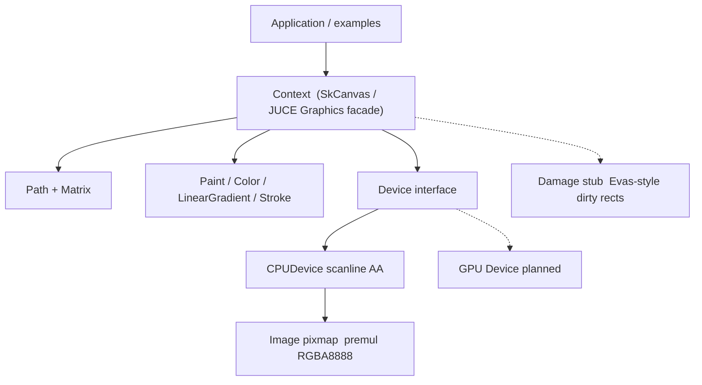

# paintengine2d

A from-scratch **pure Go 2D paint / raster engine** — the canvas you reach for
when you want anti-aliased vector fill and stroke without CGO and without
binding someone else's toolkit.

```go
img := paintengine2d.NewImage(640, 360)
ctx := paintengine2d.NewContext(img)
ctx.Clear(paintengine2d.RGB(0.10, 0.11, 0.14))
ctx.DrawCircle(paintengine2d.Pt(180, 180), 90, paintengine2d.Fill(paintengine2d.RGB(0.2, 0.5, 0.95)))
_ = img.WritePNGFile("out.png")
```

```bash
go get github.com/codemodify/paintengine2d@v0.1.0
```

**Not** a UI widget toolkit. **Not** Gio. **Not** a Skia / Cairo / Blend2D /
NanoVG binding. The rasterizer is this repository's.

| | |
| --- | --- |
| Language | Go 1.22+ |
| CGO | none |
| License | MIT |
| Pixel format | premultiplied 8-bit sRGB RGBA (`stride = width * 4`) |

## Motivation

Go's standard library can encode images, but it does not ship a paint engine.
Existing options either pull a C/C++ engine through CGO, wrap a UI toolkit, or
stop at a thin convenience layer. **paintengine2d** is a small, documented,
testable CPU canvas with a `Device` seam so a GPU backend can be added later
without changing call sites.

Inspiration (algorithms and API shape only — no vendored code):

- **AGG / Blend2D** — CPU scanline anti-aliasing
- **JUCE Graphics** — high-level facade + `LowLevel` backend
- **Skia `SkCanvas`** — canvas completeness (save, clip, path, image)
- **Evas** — dirty-rect / damage (stubbed for later)
- **Gio** — idiomatic Go packaging

## Quick start

```bash
git clone https://github.com/codemodify/paintengine2d.git
cd paintengine2d
go test ./...
go run ./examples/hello -o hello.png
```

`hello.png` should show a rounded rectangle, a cubic blob, and a thick
anti-aliased ring — curved edges blend into the background instead of stair-stepping.

```bash
go run ./examples/gallery -o gallery.png
go run ./examples/paths  -o paths.png
```

## Feature matrix

| Feature | v0.1.0 | Planned |
| --- | :---: | :---: |
| Path: move / line / quad / cubic / close | yes | |
| Rect, round-rect, ellipse, circle, arc | yes | |
| Affine transforms + save/restore | yes | |
| Solid fill, src-over blend | yes | |
| Linear gradients (clamp / repeat / mirror) | yes | |
| Radial / conic gradients | | yes |
| Stroke width | yes | |
| Caps: butt, round, square | yes | |
| Joins: miter (with limit), round, bevel | yes | |
| Dash patterns | | yes |
| Fill rules: non-zero, even-odd | yes | |
| `ClipRect` / `ClipPath` (AA mask) | yes | |
| `DrawImage` / `DrawImageRect` (bilinear) | yes | |
| Scanline AA (visible coverage) | yes | |
| PNG encode/decode (stdlib) | yes | |
| `Device` backend interface | yes | |
| CPU device | yes | |
| GPU device | | yes |
| Text / OpenType shaping | | yes (not a half-baked shaper) |
| Retained scene + Evas-style damage | stub | yes |
| SIMD | | yes |
| Blend modes beyond src-over | | yes |

**Stroke gaps (documented, not silently faked):** no dashes, no hairline
special-case below one device pixel (thin strokes still go through the
expander). Non-uniform scale distorts user-space stroke width the same way
SVG / Skia do.

**Text:** deferred on purpose. v0 is vector fill/stroke quality, not a
placeholder shaper.

## Architecture



- **`Context`** is the public canvas. It owns the transform / clip / paint stack.
- **`Device`** is the low-level backend (JUCE `LowLevelGraphicsContext` analogue).
  Geometry arrives in user space plus an affine `Matrix`; clip is already in
  device pixels. A GPU implementation can consume that without API breakage.
- **`CPUDevice`** flattens curves in device space, expands strokes in user
  space (width follows the transform), then rasterizes.

### Scanline AA (v0)

Hypothesis, verified in tests: an AGG-inspired **scanline** approach is the
right v0 tradeoff — maintainable, visibly anti-aliased, no CGO.

1. Flatten quads/cubics (adaptive de Casteljau, ~0.2 px tolerance).
2. Build directed, non-horizontal edges.
3. For each pixel row, take **8** vertical sample lines.
4. At each sample, compute exact X intersections, walk winding
   (non-zero or even-odd), and add **analytical horizontal coverage**.
5. Quantize coverage to 0–255 and src-over blend into the premul pixmap.

Axis-aligned solid rectangles use a closed-form coverage fast path (and a
zero-alloc opaque integer blit).

Curved edges show intermediate coverage; that is asserted in
`TestCircleInteriorAndAARim` and locked by golden PNGs under `testdata/golden/`.

### Pixel format

`Image.Pix` is **premultiplied** 8-bit sRGB, tightly packed RGBA.
A 50% red pixel is approximately `(128, 0, 0, 128)`, not `(255, 0, 0, 128)`.
`WritePNG` / `DecodePNG` convert to and from straight alpha for the standard
library. `Image` implements `image.Image` as `color.NRGBA`.

User space: +X right, +Y down. Pixel `(0,0)` covers `[0,1] × [0,1]`.

## Context API (sketch)

```go
ctx := paintengine2d.NewContext(img)       // or NewContextDevice(yourDevice)
ctx.Save()
ctx.Translate(40, 20)
ctx.Rotate(0.3)
ctx.ClipRect(paintengine2d.XYWH(0, 0, 200, 120))
ctx.DrawPath(path, paintengine2d.Fill(c))
ctx.DrawPath(path, paintengine2d.StrokePaint(c, 4))
ctx.DrawImageRect(src, srcRect, dstRect)
ctx.Restore()
ctx.Clear(paintengine2d.Black)             // ignores clip; resets the surface
```

`Paint.Style` may be `StyleFill`, `StyleStroke`, or `StyleStrokeAndFill`.
Convenience setters (`SetFill`, `SetStroke`, `SetColor`) feed `FillPath` /
`StrokePath` / `FillRect`.

Implement `Device` to retarget the same `Context`:

```go
type Device interface {
    Size() (w, h int)
    Clear(c Color)
    Fill(path *Path, xform Matrix, paint Paint, clip Clip)
    Stroke(path *Path, xform Matrix, paint Paint, clip Clip)
    Blit(src *Image, srcRect, dstRect Rect, xform Matrix, paint Paint, clip Clip)
}
```

## Tests and benches

```bash
go test ./...
UPDATE_GOLDENS=1 go test ./...          # rewrite testdata/golden/*.png
go test -bench . -benchmem
```

Goldens compare premul RGBA with a small per-channel tolerance. Quality tests
also assert geometry without files: circle interiors are solid, exteriors are
transparent, and the rim contains fractional coverage.

The suite also covers (inspired by public AGG / Blend2D / Skia / JUCE /
LibGfx test *themes*, not their source): save/restore stacks, clip
intersection, transform order, even-odd vs non-zero, stroke cap/join/miter
limit, gradient clamp/repeat/mirror, src-over alpha, DrawImage modulation,
empty/degenerate paths, zero-size rects, empty clip, out-of-bounds and large
coordinates, and subpixel positions.

Representative numbers on this repo's CI-like host (Go 1.22, linux/amd64,
512×512 target, `benchtime=400ms`). Treat them as a baseline, not a promise:

| Benchmark | time/op | allocs/op |
| --- | ---: | ---: |
| `BenchmarkFillRect` | ~0.15 ms | 0 |
| `BenchmarkFillComplexPath` | ~1.2 ms | 9 |
| `BenchmarkStroke` | ~2.1 ms | 18 |
| `BenchmarkManySmallPaths` (16×16 circles) | ~50 ms | ~1.8k |

Scratch paths on `Context` and insertion-sort of tiny intersection lists keep
the fill-rect path allocation-free. Flatten / stroke expansion still allocate;
that is the next CPU pass (pools, SIMD).

## Layout

```
paintengine2d/           public API (module github.com/codemodify/paintengine2d)
  context.go             canvas facade
  device.go              Device interface
  cpu.go                 CPU backend
  path.go geom.go …      geometry, paint, image, clip
  internal/raster/       flatten, scanline AA, stroke expand, blend
  examples/hello|gallery|paths
  testdata/golden/       regression PNGs (14 scenes)
```

## Positioning

**paintengine2d** is an immediate-mode CPU canvas with its own rasterizer.
It is not a widget toolkit, not a Skia/Cairo binding, and not a GPU UI stack.

Where we win today: **pure Go**, **no CGO in the paint core**, **own engine**
(you can read and change every scanline). Where we are early: **no GPU
backend yet**, **no text/OpenType**, no dashes/radials, no retained scene.

`Damage` exists as a named stub for a future retained / dirty-rect layer.
It does not change what `Context` draws today.

### Compared with alternatives

Honest snapshot of what people usually reach for. Licenses are typical
upstream terms — check the project you actually vendor. “GPU” means a
shipping hardware backend, not a future hook.

| | Language | CGO / native deps | Engine | GPU | UI toolkit | License (typical) | Best for |
| --- | --- | --- | --- | --- | --- | --- | --- |
| **paintengine2d** | Go 1.22+ | **None** | **Own** CPU scanline AA | Hook only (`Device`) | No | MIT | Embedding a small, readable Go canvas; tools, tests, offline render |
| [Gio](https://gioui.org) | Go | Optional (platform windowing) | Own ops + GPU/CPU renderer | Yes | Yes (widgets, layout, input) | MIT / Unlicense | Full native Go GUIs; not a drop-in paint library |
| [Fyne](https://fyne.io) | Go | OpenGL / platform via fyne | Own + GL | Yes (via GL) | Yes | BSD-3-Clause | Cross-platform Go apps with batteries-included widgets |
| Skia bindings | Go/C++ | **Yes** (Skia + toolchain) | Binding | Yes | No (canvas only) | Skia BSD-3 | Production 2D when you want Skia’s completeness and accept CGO |
| Cairo bindings | Go/C | **Yes** (libcairo) | Binding | Optional | No | LGPL / MPL | Existing Cairo pipelines; print/PDF-heavy apps |
| NanoVG | C (+ Go ports) | Usually yes if wrapping C | Own (GL tessellation) | Yes | No | zlib | Immediate GL vector UI chrome |
| Blend2D | C++ | **Yes** if bound from Go | Own (CPU, JIT) | No (CPU-first) | No | zlib | High-performance software 2D in C++ |
| AGG | C++ | **Yes** if bound from Go | Own (classic scanline) | No | No | BSD-style / custom | Studying / porting scanline AA; not a Go module |
| Dear ImGui | C++ | **Yes** if bound from Go | Tessellates to triangles | Via caller | Yes (immediate UI) | MIT | Debug/tools UIs — **not** a general paint/raster engine |
| HTML Canvas / webview | JS + browser | Browser or webview binary | Browser (Skia/etc.) | Yes | HTML/CSS | n/a (host) | When you already ship a web surface |

**Reading the table:** Gio and Fyne are the right answer if you need windows,
input, and widgets. Skia/Cairo/Blend2D/NanoVG are the right answer if you
need their maturity or GPU path and can take a native dependency.
paintengine2d is the right answer if you want a **Go-native paint core** you
can vendor, test, and eventually retarget (`Device`) without linking C++.

## License

MIT — see [LICENSE](LICENSE).
